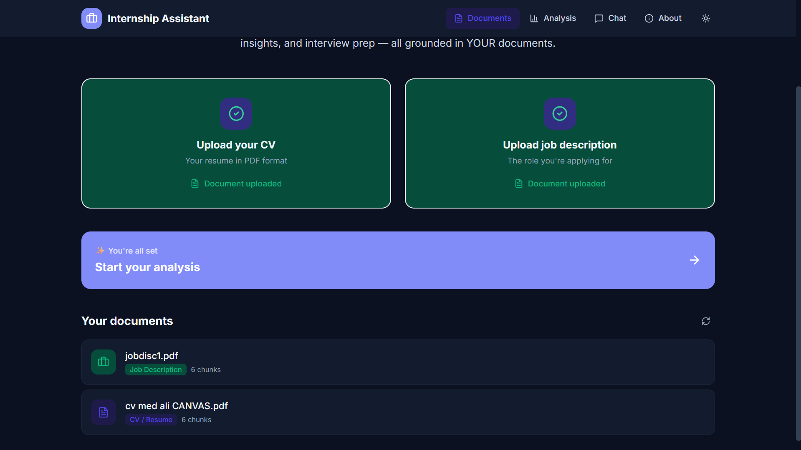
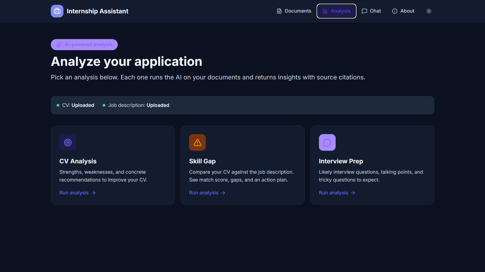
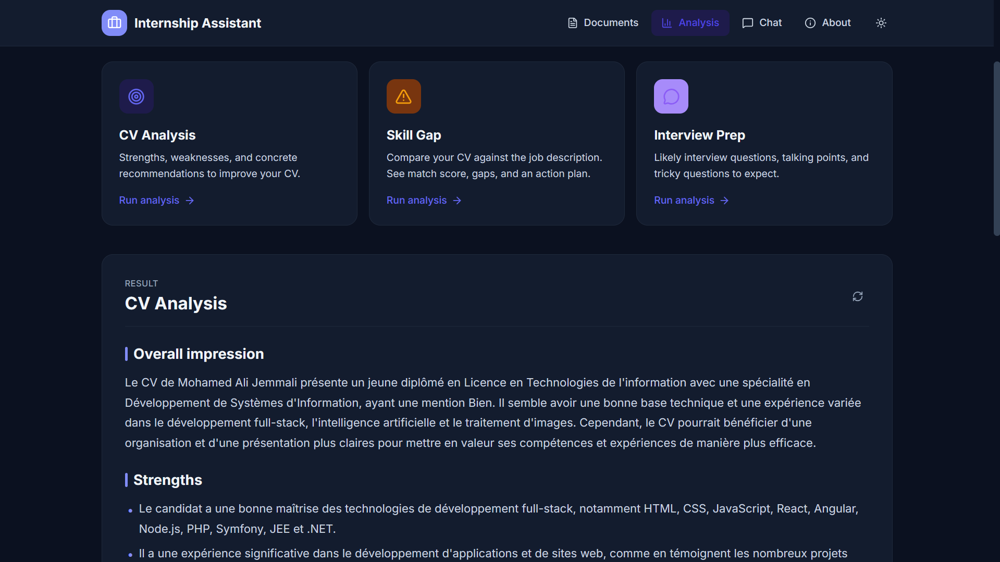
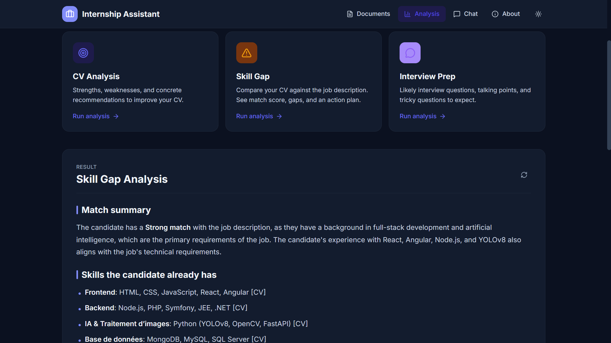
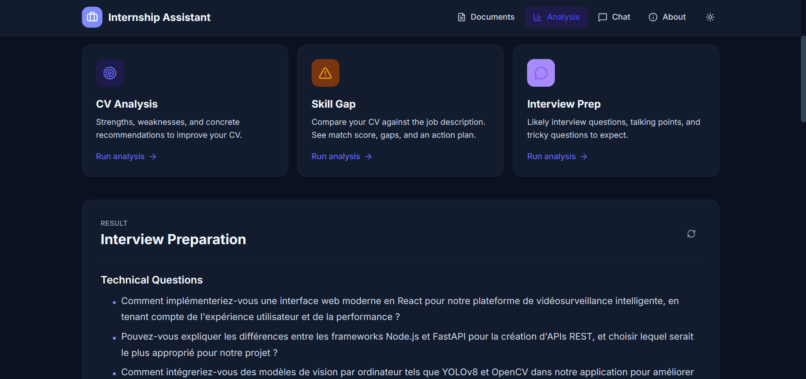
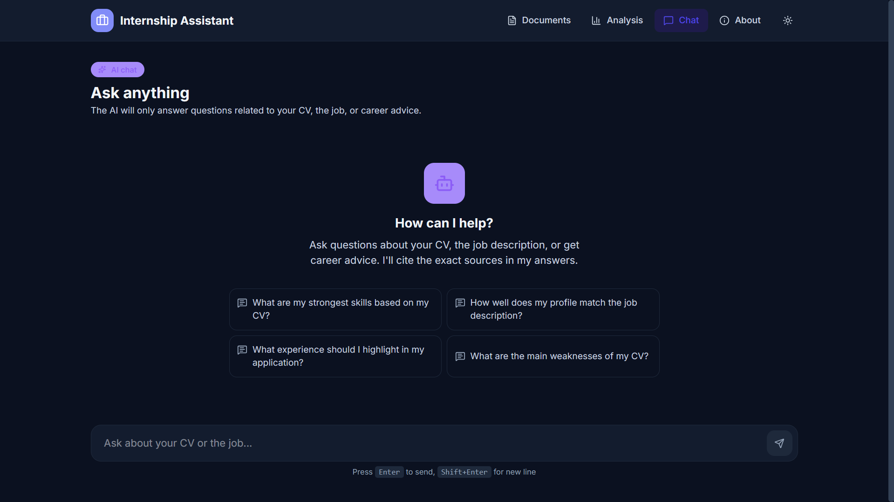
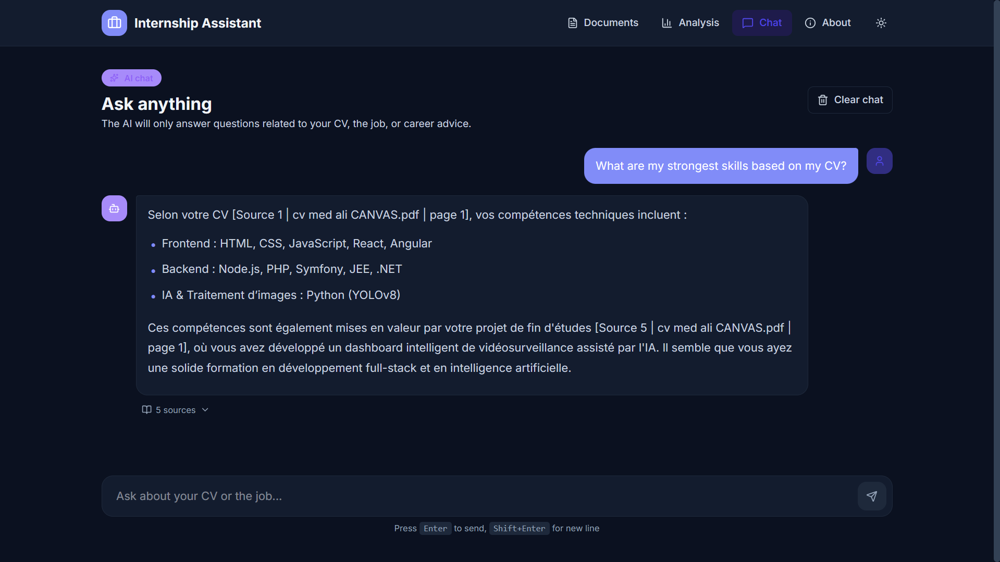
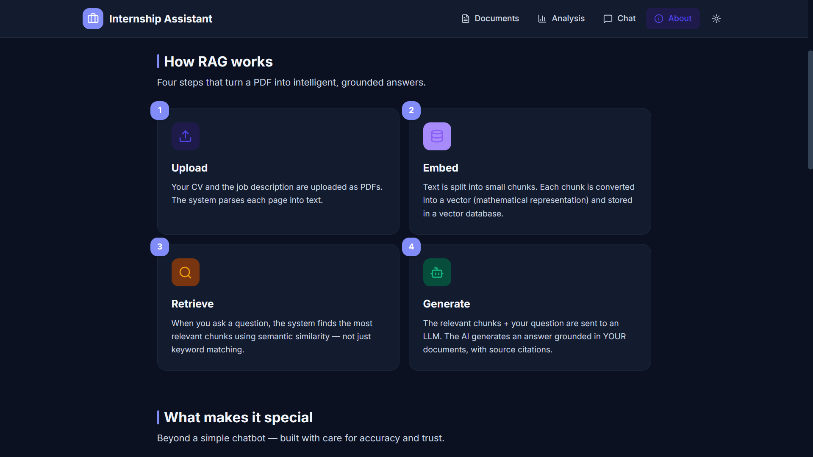

# 🎯 Internship Assistant — Frontend

> AI-powered career assistant that helps students prepare for internship and job applications. Upload your CV and a job description, get personalized analysis, skill gap insights, and interview prep — all grounded in YOUR documents with proper source citations.

[](https://react.dev)
[](https://www.typescriptlang.org)
[](https://vitejs.dev)
[](https://tailwindcss.com)

---

## 📑 Table of Contents

- [About](#-about)
- [Features](#-features)
- [Screenshots](#-screenshots)
- [Tech Stack](#-tech-stack)
- [Project Structure](#-project-structure)
- [Getting Started](#-getting-started)
- [Pages](#-pages)
- [Backend Integration](#-backend-integration)
- [Theme & Design](#-theme--design)
- [Acknowledgments](#-acknowledgments)

---

## 🎓 About

The Internship Assistant is a final-year project that uses **Retrieval-Augmented Generation (RAG)** to help students prepare for job applications. Instead of giving generic advice like ChatGPT, it reads YOUR actual CV and the actual job description you're applying to, then provides tailored insights with verifiable source citations.

### The Problem

Students apply to dozens of internships blindly. They don't know:

- 🤔 If their CV actually fits the role
- ⚠️ What skills they're missing
- 💬 How to prepare for the interview

Generic AI tools can't help here because they don't read your specific documents.

### The Solution

Upload your CV + the actual job description → get personalized, document-grounded feedback with source citations so you can verify every claim.

---

## ✨ Features

### 🛡️ 3-Layer Content Protection

The system enforces career-only usage through three independent layers:

1. **Upload validation** — Only PDFs accepted, only `cv` or `job_description` types allowed
2. **System prompts** — All AI responses are constrained to career topics
3. **AI content validator** — Before ingestion, the LLM verifies the document is actually a CV / job description (rejects grocery lists, recipes, etc.)

### 🎯 Three Specialized Analyses

| Analysis | Requires | Output |
|---|---|---|
| **CV Analysis** | CV only | Strengths, weaknesses, recommendations |
| **Skill Gap** | CV + Job description | Match score, missing skills, action plan |
| **Interview Prep** | CV or Job description | Questions, talking points, curveballs |

### 💬 Free-Form Chat

Real-time chat with the AI, restricted to career topics. Each AI message includes expandable source citations showing which chunks of your documents were used.

### 🌗 Light & Dark Mode

Both modes designed from scratch with custom CSS variables. User preference is saved in `localStorage`.

### 📱 Mobile Responsive

Hamburger menu, stacked layouts, touch-friendly interactions.

### 🔄 Smart UX Touches

- Drag-and-drop file uploads with animated states
- Auto-resize chat input
- Auto-scroll on new messages
- Custom confirmation modals (no ugly browser `confirm()`)
- Replace-existing-document flow with friendly prompts
- Keyboard shortcuts (Enter to send, Shift+Enter for new line)
- Loading states with smooth animations
- Source citations expandable on demand

---

## 📸 Screenshots

### 📁 Documents Page

The starting point. Upload your CV and the job description with drag-and-drop. Smart "replace existing" flow prevents duplicates.



### 📊 Analysis Page

Pick one of three AI analyses. Cards are intelligently disabled when prerequisites are missing.



### 🎯 CV Analysis

Detailed breakdown of strengths, weaknesses, and concrete improvement recommendations — entirely in the CV's original language.



### ⚠️ Skill Gap Analysis

Compares your CV against the job description and gives a match score, list of skills you have, gaps to fill, and an action plan.



### 💬 Interview Preparation

Generates likely interview questions categorized by type (technical, behavioral, CV-specific, curveballs).



### 🤖 Chat — Empty State

Welcoming empty state with suggested starter questions.



### 🤖 Chat — Conversation

Real conversation with AI responses including expandable source citations and proper markdown formatting.



### ℹ️ About

Explains how RAG works in 4 visual steps, lists features and the full tech stack.



---

## 🛠️ Tech Stack

### Core

- **[React 19](https://react.dev)** — UI library
- **[TypeScript 5](https://www.typescriptlang.org)** — Type safety
- **[Vite 7](https://vitejs.dev)** — Build tool & dev server

### Styling

- **[Tailwind CSS 4](https://tailwindcss.com)** — Utility-first styling
- **Custom CSS variables** — Theme system (light/dark mode)
- **[Inter font](https://rsms.me/inter/)** — Typography

### Routing & Data

- **[React Router 7](https://reactrouter.com)** — Client-side routing
- **[Axios](https://axios-http.com)** — HTTP client for the backend API

### UI Components

- **[Lucide React](https://lucide.dev)** — Icon library (modern, clean SVGs)
- **[React Markdown](https://github.com/remarkjs/react-markdown)** — Renders LLM markdown responses

---

## 📂 Project Structure
frontend/
├── public/                       # Static assets
├── screenshots/                  # README screenshots
├── src/
│   ├── api/
│   │   └── client.ts             # Axios client + API functions
│   ├── components/
│   │   ├── AnalysisCard.tsx      # Big action card on Analysis page
│   │   ├── ChatInput.tsx         # Auto-resize textarea + send button
│   │   ├── ChatMessage.tsx       # User/AI message bubble
│   │   ├── ConfirmDialog.tsx     # Reusable custom confirmation modal
│   │   ├── DocumentCard.tsx      # Document list item
│   │   ├── FileUpload.tsx        # Drag-and-drop upload zone
│   │   ├── MarkdownRenderer.tsx  # Styled markdown for AI responses
│   │   ├── Navbar.tsx            # Top nav with mobile menu
│   │   └── SourceCitation.tsx    # Source preview card
│   ├── lib/
│   │   └── ThemeContext.tsx      # Light/dark mode context
│   ├── pages/
│   │   ├── Home.tsx              # Documents page
│   │   ├── Analysis.tsx          # 3 analysis actions + results
│   │   ├── Chat.tsx              # Free-form chat
│   │   └── About.tsx             # Project explanation
│   ├── types/
│   │   └── index.ts              # TypeScript interfaces
│   ├── App.tsx                   # Router setup + ThemeProvider
│   ├── App.css
│   ├── index.css                 # Tailwind imports + theme variables
│   └── main.tsx                  # Entry point
├── index.html
├── package.json
├── tsconfig.json
├── vite.config.ts                # Vite + Tailwind plugin
└── README.md
---

## 🚀 Getting Started

### Prerequisites

- **Node.js 20+** — [Download here](https://nodejs.org)
- **npm** (comes with Node.js)
- **Backend API running** at `http://127.0.0.1:8000` — see the backend repo for setup

### Installation

1. Clone the repository:

```bash
   git clone https://github.com/YOUR_USERNAME/internship-assistant-frontend.git
   cd internship-assistant-frontend
```

2. Install dependencies:

```bash
   npm install
```

3. Make sure the backend is running on port 8000.

4. Start the dev server:

```bash
   npm run dev
```

5. Open [http://localhost:5173](http://localhost:5173) in your browser.

### Available Scripts

| Command | What it does |
|---|---|
| `npm run dev` | Start dev server with hot reload at localhost:5173 |
| `npm run build` | Production build into `dist/` |
| `npm run preview` | Serve the production build locally for testing |
| `npm run lint` | Run ESLint |

### Configuration

The backend URL is hardcoded in `src/api/client.ts`:

```typescript
const API_BASE_URL = "http://127.0.0.1:8000";
```

To point to a different backend (e.g., production), update this constant.

---

## 📄 Pages

### `/` — Documents

The home page where users upload their CV and the job description. Features:

- 🎯 Hero section explaining the project
- 📤 Two side-by-side upload zones (CV + Job Description)
- 📋 List of currently uploaded documents with type badges
- 🔄 Replace-existing flow with confirmation modal
- 🗑️ Delete with red destructive confirmation
- ✨ "Start your analysis" CTA when both documents are uploaded

### `/analysis` — Analysis

Three big action cards that trigger AI analyses with one click. Features:

- 📊 Live status banner showing which documents are uploaded
- 🔒 Cards intelligently lock when prerequisites aren't met
- ⏳ Pulsing loading state during AI calls
- 📝 Markdown-rendered results with proper formatting
- 📚 Source citations with relevance scores and previews
- 🔄 Re-run any analysis with one click

### `/chat` — Chat

Free-form Q&A with the AI, restricted to career topics. Features:

- 🤖 Welcome state with 4 suggested starter questions
- 💬 Real chat UI: user bubbles right (indigo), AI bubbles left (white card)
- ⌨️ Auto-resize textarea, Enter-to-send, Shift+Enter for new line
- 📍 Auto-scroll to latest message
- 📚 Sources expandable per AI message
- 🧹 Clear chat with confirmation
- ⌨️ Keyboard shortcut hints

### `/about` — About

Visual explanation of the project. Features:

- 🎓 Hero with project pitch
- 📊 4-step RAG explanation diagram
- ⭐ Feature highlights
- 🛠️ Categorized tech stack with colored badges
- 📁 Live folder structure code block
- 👤 Developer card with gradient background

---

## 🔌 Backend Integration

The frontend communicates with a FastAPI backend through these endpoints:

| Method | Endpoint | Description |
|---|---|---|
| `GET` | `/` | Health check |
| `POST` | `/upload` | Upload a CV or job description (multipart/form-data) |
| `GET` | `/documents` | List all uploaded documents |
| `DELETE` | `/documents/{doc_id}` | Delete a document by ID |
| `POST` | `/chat` | Free-form chat |
| `POST` | `/analyze/cv` | CV-only analysis |
| `POST` | `/analyze/skill-gap` | CV vs Job description |
| `POST` | `/analyze/interview` | Interview prep questions |

CORS is configured in the backend to accept requests from `http://localhost:5173` (Vite default).

See the [backend repository](https://github.com/YOUR_USERNAME/internship-assistant-backend) for full API documentation and setup.

---

## 🎨 Theme & Design

### Color Palette: Indigo Twilight

| Role | Light | Dark |
|---|---|---|
| Primary brand | `#6366F1` (Indigo) | `#818CF8` |
| Accent | `#8B5CF6` (Violet) | `#A78BFA` |
| Success | `#10B981` (Emerald) | `#34D399` |
| Warning | `#F59E0B` (Amber) | `#FBBF24` |
| Danger | `#EF4444` (Red) | `#F87171` |
| Page background | `#F8FAFC` (Slate 50) | `#0B1120` |
| Card background | `#FFFFFF` | `#131C2E` |

All colors are defined as CSS variables in `src/index.css` and switch automatically between modes.

### Design Principles

- 🤍 **Generous whitespace** — content has room to breathe
- 🎯 **Soft borders + subtle shadows** — depth without being heavy
- ⚡ **Smooth transitions** — every interaction feels responsive
- 🔘 **Rounded corners** — `rounded-xl` and `rounded-2xl` for a modern feel
- 🃏 **Card-based layouts** — easy to scan, mobile-friendly
- ✨ **Microinteractions** — hover effects, scale on click, fade-in animations

### Animations

Custom keyframes defined in `index.css`:

- `fadeIn` — Subtle slide-up + opacity fade for content reveals
- `pulseGlow` — Soft glow ring for loading states
- `bounce` (Tailwind) — Used for typing indicator dots

---

## 🙏 Acknowledgments

- **[Anthropic Claude](https://claude.ai)** — For AI pair programming during development
- **[Groq](https://groq.com)** — For the lightning-fast free LLM inference
- **[Lucide](https://lucide.dev)** — For the beautiful icon set
- **[Tailwind CSS](https://tailwindcss.com)** — For making styling enjoyable
- **ISET Mahdia** — Where this project was born 🎓

---

## 👤 Author

Built by **Mohamed Ali**.


---

<p align="center">Built with ❤️ and lots of ☕</p>